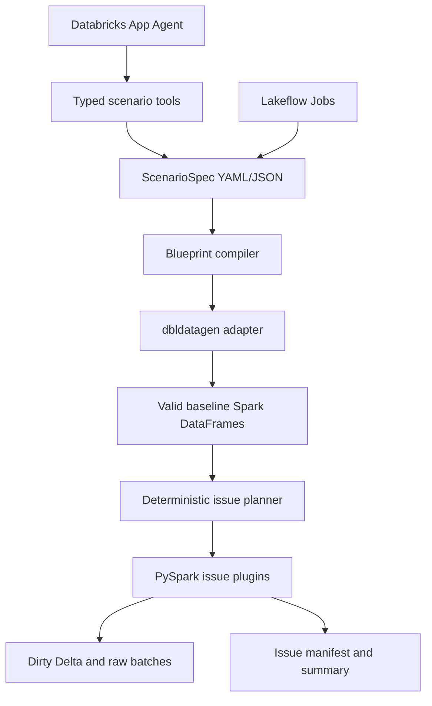

# Scenario Data Factory

Scenario Data Factory is a Databricks-native accelerator that uses Databricks Labs
`dbldatagen` to generate realistic, reproducible datasets with deliberate and configurable
data issues.

It is focused on one job: create valid synthetic business data, inject known issues, and record
exactly what changed so data engineering, data quality, governance, and AI demos can be repeated.

## What It Does

- Generates baseline Spark DataFrames through `dbldatagen`, not an LLM.
- Provides insurance claims and retail orders blueprints.
- Validates table, column, and relationship references in a strict `ScenarioSpec`.
- Plans deterministic issue targets from a stable seed.
- Supports 12 issue types, including physical raw-file issues such as file replay and schema drift.
- Writes issue manifests and run summaries.
- Includes a Databricks App and OpenAI Agents SDK interface that edits specs through typed tools.
- Keeps generation runnable from saved YAML/JSON without the agent.

## What It Does Not Do

- It is not pipeline monitoring, observability, or automatic pipeline repair.
- It does not execute model-generated Python or SQL.
- It does not use real customer data.
- It does not require Supervisor API, MCP servers, Genie, Lakebase, Vector Search, or AI Gateway for v1.

## Architecture



## Databricks Components

- Databricks Apps for the custom agent and minimal API.
- MLflow AgentServer pattern with module-level `@invoke` and `@stream` handlers.
- OpenAI Agents SDK for bounded tool orchestration.
- Lakeflow Jobs for initialize, preview, generate, and smoke-test tasks.
- Unity Catalog schemas, volumes, and Delta tables.
- Declarative Automation Bundles for repeatable deployment.

## Why dbldatagen

`dbldatagen==0.4.0` is pinned as the baseline data generator. The package is a Databricks Labs
project, so production users should treat it with the governance expectations that apply to Labs
software. Scenario Data Factory wraps it behind `DbldatagenEngine` so issue injection, app tools,
and output writers do not depend directly on its API.

## Quick Start

```bash
uv sync --extra dev
uv run sdf new --scale small --output examples/insurance_claims.yaml
uv run sdf validate examples/insurance_claims.yaml
uv run sdf estimate examples/insurance_claims.yaml
uv run sdf smoke-test
```

## One-Command Installation

The intended colleague command is:

```bash
uv run sdf install --profile <databricks-profile> --target dev
```

The current local installer performs preflight guidance. Workspace deployment requires a configured
Databricks profile and the bundle variable `model_endpoint`.

## Engine-Only Installation

```bash
uv run sdf install --profile <databricks-profile> --target dev --engine-only
databricks bundle validate --profile <databricks-profile> --target dev --var model_endpoint=<endpoint>
databricks bundle deploy --profile <databricks-profile> --target dev --var model_endpoint=<endpoint>
```

## Demo Scenario

The main blueprint is `Canadian Insurance Claims Reliability Scenario`, seed `42`, with customers,
policies, claims, and payments. It includes duplicate claims, policy orphans, missing adjuster IDs,
late payments, invalid date order, file replay, schema drift, and correlated missingness.

## ScenarioSpec Reference

Important fields:

- `scenario_id`, `name`, `domain`, `seed`, `locale`, `revision`
- `timeline.start_date`, `timeline.batches`
- `tables[].columns[]`
- `relationships[]`
- `issues[]`
- `outputs`

Every spec has canonical JSON and a SHA-256 spec hash for confirmation and reproducibility.

## Supported Blueprints

- `insurance_claims`
- `retail_orders`
- `custom_schema` for explicit specs

## Supported Issues

- `null_value`
- `blank_value`
- `duplicate_record`
- `invalid_format`
- `invalid_value`
- `referential_orphan`
- `date_rule_violation`
- `late_arrival`
- `out_of_order`
- `file_replay`
- `schema_drift`
- `correlated_missingness`

## Raw Versus Delta Output

Delta output is used for typed clean and dirty tables. Raw output is required for physical issues
where malformed files, replayed batches, schema-varying records, or ordering must be represented.

## Manifest Schema

Each manifest row contains `issue_id`, `issue_type`, `table`, `column`, `record_key`, `batch_id`,
and plugin `details`.

## Reproducibility

Issue targets are selected by hashing the scenario seed, scenario ID, issue ID, issue type, and
record key. Stable keys avoid partition-count dependence.

## Local Development

```bash
uv run pytest
uv run ruff check .
uv build
```

## Bundle Deployment

```bash
databricks bundle validate --target dev --var model_endpoint=<endpoint>
databricks bundle deploy --target dev --var model_endpoint=<endpoint>
databricks apps deploy scenario-data-factory --source-code-path <workspace bundle files path>
```

The explicit `databricks apps deploy` step is retained because Databricks App source deployment can
require an explicit source path after bundle deployment.

## Security

All generated personal-looking data is synthetic. Do not use real customer data as input. Do not
store personal access tokens in source control. The App is designed for Databricks resource bindings
and app service-principal authorization.

## Known Limitations

- Full Spark/dbldatagen generation is intended for Databricks or a compatible local Spark runtime.
- Workspace validation, deployment, and smoke tests require Databricks credentials and permissions.
- The included UI is minimal API-first scaffolding; the official built-in chat UI can be synced from
  the Databricks custom-agent template when initializing in a workspace.
